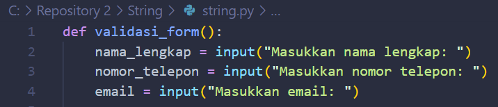
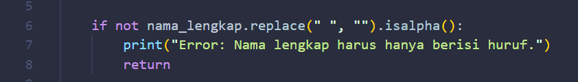
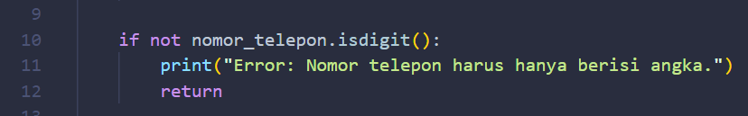
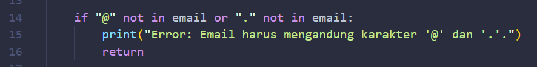
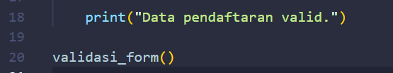
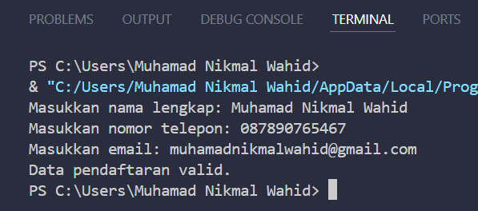
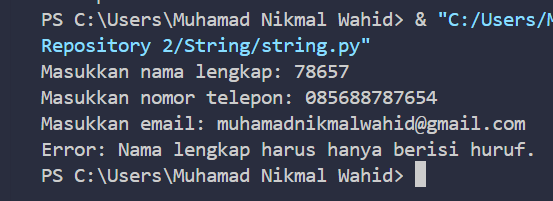
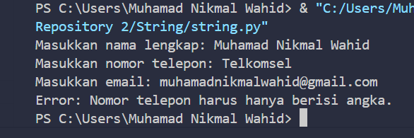
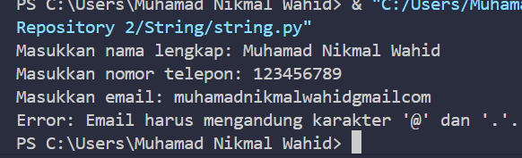

# String

## Penjelasan kode 

- Fungsi ini berguna untuk menangani seluruh proses validasi form. Dengan hal ini kita bisa memanggil validasi_form() kapan saja dalam program untuk memeriksa input 

- Program akan meminta kita untuk memasukkan tiga input yaitu nama, nomor telepon dan email. 

- replace(" ", ""): Menghapus semua spasi dalam string 

- isalpha(): Memeriksa apakah semua karakter dalam string adalah huruf.

- not: Digunakan untuk membalikkan hasil dari isalpha(). Jika nama tidak valid, program mencetak pesan error dan keluar dari fungsi dengan return.

- isdigit(): Memeriksa apakah string hanya berisi angka. Jika nomor telepon berisi karakter selain angka, validasi gagal.

- not: Membalikkan hasil untuk menangani input yang tidak valid.

- "@" not in email: Memastikan bahwa karakter @ ada dalam email.

- "." not in email: Memastikan bahwa karakter . juga ada dalam email.

- or: Jika salah satu kondisi tidak terpenuhi, validasi gagal.

- Jika semua validasi lolos, program mencetak pesan bahwa data pendaftaran valid.

- Fungsi validasi_form() dipanggil untuk memulai proses validasi. Anda dapat menempatkannya di berbagai bagian program jika diperlukan

# HASIL 

### Semua Input Valid

### Nama Tidak valid

### Nomor Telepon Tidak Valid

### Email Tidak Valid 

